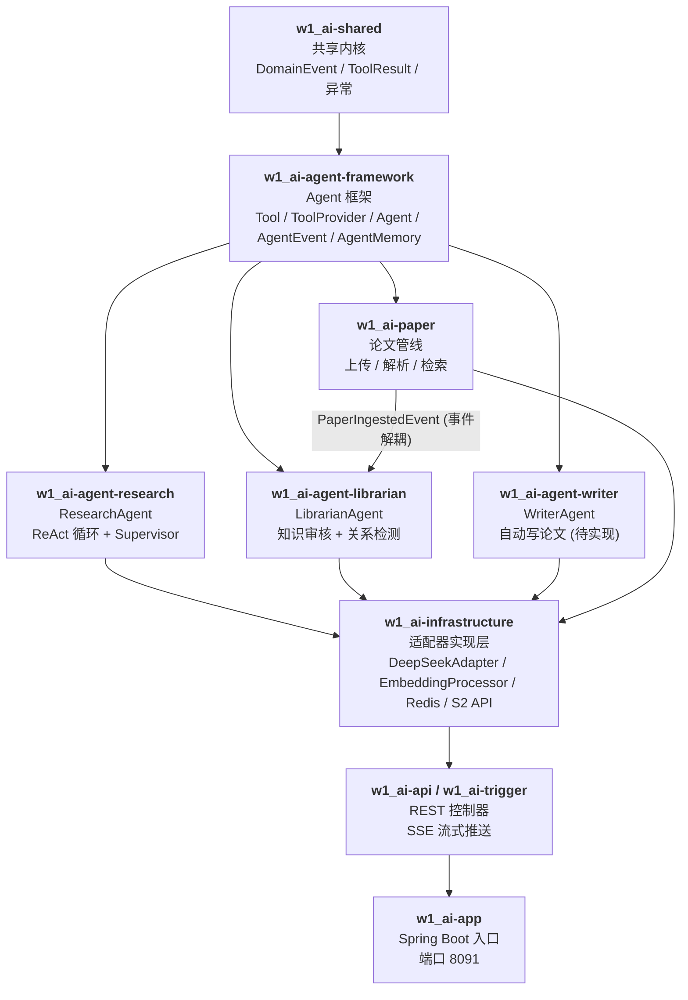

# ScholarBrain — Agent 驱动的论文深度阅读与写作系统

针对传统 RAG 处理长篇科研论文时存在的"切片逻辑断裂"、"数学符号语义丢失"及"引用溯源困难"的问题，构建了一款基于 Agent-First 思想的深度阅读系统。系统模拟人类研究员的"检索→目录定位→深度阅读→引用溯源"过程，并通过远程 MonkeyOCR、可审计 Outline 恢复、符号提取和引用关系增强构建论文知识库。

> 当前 RAGAS 数据仅包含 10 条探索性样本，不足以作为稳定基准。仓库保留历史报告用于回归分析，但不再引用单次最高结果作为项目最终性能；正式指标将在检索链路升级和评测集扩充后重新发布。

## 架构总览



## 模块说明

| 模块 | 类型 | 职责 |
|------|------|------|
| `w1_ai-shared` | **新** | 共享内核：`DomainEvent<T>`, `ToolResult`, `ResponseCode`, `AppException` |
| `w1_ai-agent-framework` | **新** | Agent 框架抽象：`Tool`, `ToolProvider`, `Agent`, `AgentEvent`, `AgentMemory`, `AgentOrchestrator` |
| `w1_ai-agent-research` | **新** | 研究 Agent：ReAct 循环执行 思考→行动→观察，负责论文问答 |
| `w1_ai-agent-librarian` | **新** | 馆员 Agent：知识审核、论文间关系检测、新颖性评估 |
| `w1_ai-agent-writer` | **新** | 写作 Agent（骨架）：论文大纲生成、章节撰写、引用管理 |
| `w1_ai-paper` | **新** | 论文管线：PDF 上传→MonkeyOCR 解析→Outline 恢复→符号/引用增强→向量检索 |
| `w1_ai-infrastructure` | 旧 | 所有适配器实现：数据库、Redis、LLM、PDF 解析、嵌入向量 |
| `w1_ai-api` | 旧 | REST 接口定义 + DTO |
| `w1_ai-trigger` | 旧 | HTTP 控制器实现 |
| `w1_ai-app` | 旧 | Spring Boot 入口 + Bean 配置 |

### 核心设计原则

- **接口隔离**：每个 Agent 模块通过 `api/` 包暴露接口，外部只依赖接口
- **事件解耦**：Paper 模块发布 `PaperIngestedEvent`，Librarian 模块异步监听，互不 import
- **构造器注入**：全部使用 constructor injection，去除 `@Resource` 字段注入
- **依赖单向**：`shared ← framework ← agent/paper ← infrastructure ← app`

## 技术栈

| 层级       | 技术                                                   |
|-----------|-------------------------------------------------------|
| 后端框架    | Java 17, Spring Boot 3.2.1, Maven 多模块              |
| AI/LLM    | LangChain4j 0.35.0, DeepSeek Chat API                 |
| 嵌入模型    | Alibaba DashScope text-embedding-v4 (1536维)          |
| 数据库     | PostgreSQL + pgvector (向量相似度搜索)                  |
| 缓存       | Redis (会话记忆 + 分布式锁)                             |
| ORM       | MyBatis-Plus 3.5.5                                    |
| PDF 解析   | 远程 MonkeyOCR HTTP 服务（LlamaParse 作为可选回退）       |
| 外部 API   | Semantic Scholar API (引文元数据)                       |
| 前端       | Streamlit (Python)                                     |
| 评估       | RAGAS (Faithfulness, AnswerRelevancy, ContextRecall)   |

## API 接口

基础路径为 `http://localhost:8091`。论文上传已经升级为异步摄取任务，接口返回 `jobId`，再通过任务接口查询 `paperId` 和处理状态。

### Agent 流式问答

```bash
GET /api/v1/agent/ask-stream?sessionId={id}&question={问题}
# 返回 SSE 流 (text/event-stream)，实时推送 THOUGHT/ACTION/OBSERVATION/ANSWER 事件
```

### 论文管理

```bash
POST   /api/v1/paper/upload                         # 上传 PDF，返回 202 + jobId
GET    /api/v1/paper/ingestions/{jobId}             # 查询摄取状态与失败原因
POST   /api/v1/paper/ingestions/{jobId}/retry       # 从失败阶段继续
POST   /api/v1/paper/ingestions/{jobId}/rerun       # 从指定 stage 重跑
GET    /api/v1/paper/list                           # 论文列表
GET    /api/v1/paper/{paperId}/details              # 论文详情 + Librarian 审计报告
```

### 科研工具

```bash
GET  /api/v1/research-tools/library/search?query={q}&paperId={id}&threshold={t}
GET  /api/v1/research-tools/papers/{paperId}/outline
GET  /api/v1/research-tools/sections/{sectionUuid}
GET  /api/v1/research-tools/papers/{paperId}/reference/{refIndex}
GET  /api/v1/research-tools/papers/{paperId}/relations
GET  /api/v1/research-tools/papers/find?query={q}&threshold={t}
GET  /api/v1/research-tools/references/top-cited?limit={n}
```

## 快速开始

### 环境要求

- Java 17+
- Maven 3.9+
- PostgreSQL 14+ (需安装 pgvector 扩展)
- Redis 7+
- Python 3.10+ (用于 PDF 解析)

### 编译

```bash
mvn clean compile
```

### 启动

```bash
# 确保 PostgreSQL 和 Redis 已启动
# 在 config/application-local.yml 中配置本地密钥和解析器地址

mvn spring-boot:run -pl w1_ai-app
# 应用启动在 http://localhost:8091
```

### 前端测试

```bash
pip install streamlit sseclient requests pandas
python python/streamlit_app.py
# 浏览器打开 http://localhost:8501
```

### 接口测试

```bash
# 上传论文
curl -X POST http://localhost:8091/api/v1/paper/upload -F "file=@test.pdf"

# 查看论文列表
curl http://localhost:8091/api/v1/paper/list

# 流式问答
curl -N "http://localhost:8091/api/v1/agent/ask-stream?sessionId=test&question=这篇论文的核心创新点是什么"

# 搜索论文库
curl "http://localhost:8091/api/v1/research-tools/library/search?query=soliton"
```

### RAGAS 评估

```bash
cd python/evaluation
pip install ragas datasets langchain-openai langchain-google-genai
python eval.py
```

当前目录中有两次 10 条样本的探索性报告，结果波动较大。评测脚本依赖外部裁判模型，运行前需要通过环境变量配置 `GOOGLE_API_KEY` 和 `DEEPSEEK_API_KEY`。后续将把评测集扩充到 30～50 条，并分别报告检索 Recall@K、Context Precision、Faithfulness 和 Answer Relevancy。

### 测试分层

默认 Maven 测试只运行不依赖数据库、外部 API 和远程 GPU 的 `*UnitTest`：

```bash
mvn test -pl w1_ai-app -am
```

MonkeyOCR 和公网连通性测试使用 `*ExternalIT` 命名，默认不会执行。手动运行 MonkeyOCR 外部测试前需保持 SSH 隧道并设置：

```bash
export MONKEYOCR_TEST_PDF=/absolute/path/to/paper.pdf
```

Outline 回归样本位于 `w1_ai-app/src/test/resources/outline-samples`，可在全新 clone 和 CI 环境中复现。

## 添加新 Agent 指南

得益于 Agent 框架化设计，添加一个新的 Agent 只需 3 步：

1. **新建模块**，依赖 `w1_ai-agent-framework`
2. **定义接口** 在 `api/` 包，继承框架抽象：
   ```java
   public interface IMyAgent {
       void execute(String input);
   }
   ```
3. **实现类** 在 `internal/` 包，使用 `ToolProvider` 获取工具，用 `AgentEvent` 推送状态：
   ```java
   @Service
   public class MyAgentImpl extends Agent implements IMyAgent {  }
   ```

## 路线图

- [x] Agent 框架化重构（模块拆分、接口隔离、事件解耦）
- [x] 远程 MonkeyOCR HTTP 接入与可审计 Outline 归一化
- [x] `IEmbeddingService`、`IFileStorageService`、`AgentMemoryFactory` 基础适配
- [x] 完成论文摄取状态机、失败审计和阶段重跑（见 `PHASE1_INGESTION.md`）
- [ ] 升级混合检索、重排与可复现 RAG 评测
- [ ] 完成 Agent 章节证据引用和 Librarian 置信度机制
- [ ] 废弃并删除 `w1_ai-domain` 和 `w1_ai-types` 旧模块
- [ ] PostgreSQL/pgvector/Redis Docker Compose 与数据库迁移
- [ ] WriterAgent（非当前主线，保留骨架）
